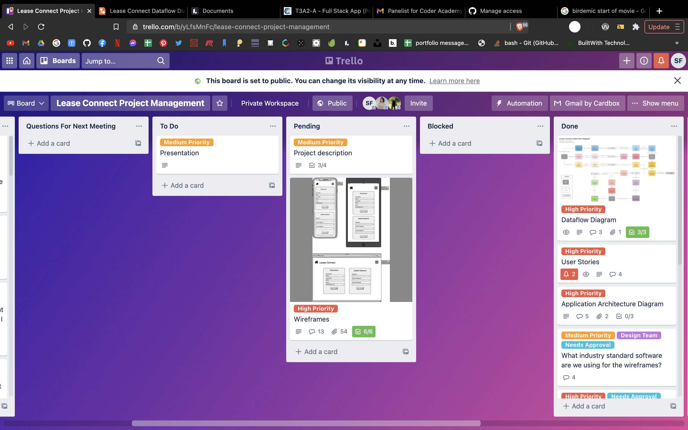

# T3A2-A - Full Stack App - Lease Connect
Coder Academy CA0121 Final project\
Collaborators: Gemma Elsom, Rafael Mello, Sara Fishburn

**Trello Board:** https://trello.com/b/yLfsMnFc \
**Backend Repo:** https://github.com/SaraFishburn/lease_connect_api \
**Frontend Repo:** https://github.com/SaraFishburn/lease_connect \
**Dataflow Diagram:** https://lucid.app/lucidchart/c748d4d5-41ff-4216-b178-49f2531033b7/view

## Lease Connect - Description
### Purpose

  One of the most common causes of frustration for tenants and property managers is the lack of or difficulty in contact. Missing calls and emails without replies can make people frustrated. And this is not very good for the business.
  A property manager should be reachable to their tenants without endless emails. 

  The purpose of Lease Connect is to relieve some of these frustrations.

   Managers or their teams can provide the best solution to the issue during business hours. With property management software the communication can go smoothly and without inconvenience at any time.
  Also property managers have a very busy life. At the office, on the road or visiting properties, they are always on the go. Having a mobile version all in one management application can help them to do the work wherever they are.

### Functionality / features

  There are three main features of Lease Connect.

  - Maintenance Request \
    If a tenant has a maintenance issue, they may take a photo of the issue and complete a form within Lease Connect that may then be sent to the real estate for the maintenance to be organized.

    - Status Flags \
    Property managers will have the ability to set flags on these requests with pending and done to notify the tenant as to the status of the processing of the request.

  - Documentation \
    On a 'documentation' page, tenants have the ability to view all their documents pertaining to their rental (lease, entry condition report, etc) in one place. Buttons for each document will be present which when selected will direct the tenant to an image of the document in question.

    Property managers will have the ability to upload documents to a household for viewing by the tenants.

  - Calendar \
    The landing page for the tenant will be their calendar page. This page features a calendar on which events entered by the property manager pertaining to the house are marked. These events may include the expiration of the lease, maintenance entry notices, and inspection dates.

    Property managers will have the ability to add these events. In addition, property managers will have their own calendar containing all the events related to their 'pinned' properties.
  
  In addition to these main features are a number of general and additional features.

  - Creating an account \
    The general public will not have the ability to register an account and therefore accounts must be created by admin and property managers.

    Property managers will have the authority to create tenant accounts while admin will be capable of creating tenant and property manager accounts.

    Upon the creation of the account, an email is sent to the account recipient with temporary login details.

  - Login \
    For users to access the application, they must first login with their email and password.

  - Editing Account \
    All users will have the ability to change their contact details and password once logged in.

  - Pinning \
    The landing page for a property manager will display all the houses managed by the company. Property managers will have the ability to 'pin' houses they specifically look after to the top of the page for easy access.

### Target audience
  The target audience for Lease Connect from a client perspective is real estate agencies located in metropolitan areas in Australia. Mainly concentrated in the rentals department of those businesses. Companies that appreciate tech solutions and see the digital transformation as a great opportunity to create a more efficient and cohesive service to their tenants.

  The other audience this application is purposed for is the tenants of these businesses that appreciate a technology based solution to the communication issues that arise when renting a property managed by a real estate.

### Tech Stack

#### Front End
- React: React will be used to develop the front-end of the application. It is a Javascript library that is used to build interactive user interfaces. 

- Netlify: Netlify will be used to deploy the front-end of Lease Connect. It is a serverless and cloud-based hosting platform, and is best used for front-end deployment.

- Cloudinary: Cloudinary will be used to store all media that can be uploaded onto the application. Cloudinary offers a cloud-based solution to handling images and videos at any scale. 

#### Back End

- Heroku: Heroku will be used to deploy the back-end of Lease Connect. Heroku is a serverless and cloud-based hosting platform, and offers scalability and security to developers.

- PostgreSQL: PostgreSQL will be the database system that will be used for Lease Connect. It is a powerful, object-relational database system that can be used to store data for both web and mobile applications.

- Rails: Ruby on Rails will be used to build the back-end of Lease Connect. It is a server-side web application framework. 

## Dataflow Diagram

The following diagram outlines the flow and storage of data throughout the application. All data flow begins with the action of an external entity which in this case is a user of the application. The user action triggers a process on the front end that in turn activates a process on the backend server via a request to the backend API. The server then queries or stores data in the database and sends a response back to the frontend where appropriate.

## Application Architecture Diagram

The Architecture Diagram for the Lease Connect Application has been split into two sections, Client and Server. There is a key in the top left of the page that shows the meaning of different colours used throughout the diagram.

All Client side architecture is in Green, and has been wrapped in a container to show that Netlify will be the deployment platform for the front-end. React will be used to build the front-end of the application.

Heroku is the deployment platform that will be used for the back-end of the application, and the server and database are included in this. In Yellow are the API's that are used in the application, JSON and Cloudinary. The two types of Client to Server requests that will be made are JSON and HTTP.

## User Stories
### MVP

  #### General Features
  As a user I want an option for me to update my contact details so that my property manager can always contact me.

  As an admin, I can create a household account with temporary login details so that I have control over who has an account.

  As an admin, I can create a property manager account with temporary details so that I can control who has access to household details.

  As an admin, I have the ability to delete household and property manager accounts so that I have control of who can access household details.

  As a user, I want to be able to log in, so that I can access my account.

  #### Maintenance Request
  As a property manager, I want to see which tenant made the maintenance request, so I can know who made the request and where I should send my maintenance team

  As a property manager, I want to see all the maintenance jobs requests, so I can help the tenants to get their problem fixed

  As a tenant, I want to upload a photo of my problem, so the property manager can understand clearly what is the problem

  As a tenant, I want to lodge a maintenance job when I have something to get fixed at the property, so I can get the problem solved

  #### Documentation
  As a property manager, I want to be able to serve tenants with documents, so that I don't have to send them emails with pdf attachments.

  As a user, I want to be able to see all documentation that relates to the household.

  #### Calendar

  As a property manager, I want to be able to clearly see all commitments I have on a given day, so that I can be sure to not miss anything important.

  As a tenant, I want to have full coverage of any important dates, visits or inspections so that I can plan my life around these appointments.

  As a property manager, I want to have all of my tenants lease dates in my calendar so that all of the information is stored in one, easy to read place

  As a property manager, I want all maintenance appointments to be stored in the calendar, and for the tenant to be able to see them too. This is so that both parties are aware of when a visitor will be attending the property.

### Non-MVP
  The following are user stories that are not integral to the main functionality of the app but that may be implemented as features in the future.

  #### Maintenance
  As a tenant, I want to track my maintenance job application, so I can monitor my application and know what happens next

  #### Documentation
  As a tenant, I want to sign my lease renewal using an online form, so that I don't need to print and fill a pdf document.

  As a tenant, I want to sign my entry condition report online so that I don't have to print and fill a pdf document.

  As a tenant, I want to review and print my previously signed documents so that I can always have a hard copy.

  As a tenant, I want the option to save my signature for future use so that I don't have to manually sign/upload my signature for each document.

  As a tenant, I want to receive a notification on my portal dashboard when a document has been uploaded for me to sign so that I don't forget.

  #### Calendar
  As a property manager, I want to be able to add reminders for inspections that tenants can also see, so that everyone is aware of upcoming important dates

  As a property manager, I want to be able to add things to my calendar that only I have visibility to, so that I can choose what information is visible by the tenants

  As a property manager, I want to be able to block out periods of time that I am OOO and cannot assist with enquiries, so that tenants are aware of why I may not respond immediately.

## Wireframes

General Components Wireframes

  

Property Manager Wireframes

Tenant Wireframes

Admin Wireframes

## Trello Screenshots

