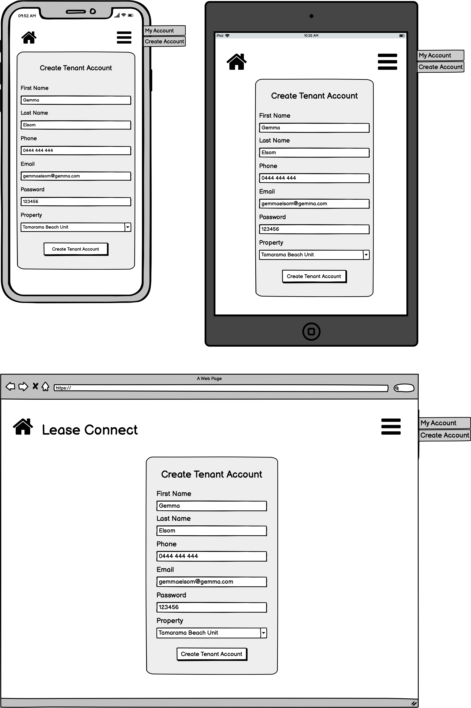

# T3A2-A - Full Stack App - Lease Connect
Coder Academy CA0121 Final project\
Collaborators: Gemma Elsom, Rafael Mello, Sara Fishburn

**Trello Board:** https://trello.com/b/yLfsMnFc \
**Backend Repo:** https://github.com/SaraFishburn/lease_connect_api \
**Frontend Repo:** \
**Dataflow Diagram:** https://lucid.app/lucidchart/c748d4d5-41ff-4216-b178-49f2531033b7/view

## Lease Connect - Description
- Purpose

  One of the most common causes of frustration for tenants and property managers is the lack of or difficulty in contact. Missing calls and emails without replies can make people frustrated. And this is not very good for the business.
  A property manager should be reachable to their tenants without endless emails. 

  The purpose of Lease Connect is to relieve some of these frustrations.

   Managers or their teams can provide the best solution to the issue during business hours. With property management software the communication can go smoothly and without inconvenience at any time.
  Also property managers have a very busy life. At the office, on the road or visiting properties, they are always on the go. Having a mobile version all in one management application can help them to do the work wherever they are.

- Functionality / features

  There are three main features of Lease Connect.

  - **Maintenance Request** \
    If a tenant needs to speak to their property manager about, for example, a maintenance issue, they can do it anytime lodging an application.

  - **Documentation**

  - **Calendar**

- Target audience
  The target audience for Lease Connect from a client perspective is real estate agencies located in metropolitan areas in Australia. Mainly concentrated in the rentals department of those businesses. Companies that appreciate tech solutions and see the digital transformation as a great opportunity to create a more efficient and cohesive service to their tenants.

  The other audience this application is purposed for is the tenants of these businesses that appreciate a technology based solution to the communication issues that arise when renting a property managed by a real estate.

- Tech stack

### Tech Stack

#### Front End
- React: React will be used to develop the front-end of the application. It is a Javascript library that is used to build interactive user interfaces. 

- Netlify: Netlify will be used to deploy the front-end of Lease Connect. It is a serverless and cloud-based hosting platform, and is best used for front-end deployment.

- Cloudinary: Cloudinary will be used to store all media that can be uploaded onto the application. Cloudinary offers a cloud-based solution to handling images and videos at any scale. 

#### Back End

- Heroku: Heroku will be used to deploy the back-end of Lease Connect. Heroku is a serverless and cloud-based hosting platform, and offers scalability and security to developers.

- PostgreSQL: PostgreSQL will be the database system that will be used for Lease Connect. It is a powerful, object-relational database system that can be used to store data for both web and mobile applications.

- Rails: Ruby on Rails will be used to build the back-end of Lease Connect. It is a server-side web application framework. 

## Dataflow Diagram

The following diagram outlines the flow and storage of data throughout the application. All data flow begins with the action of an external entity which in this case is a user of the application. The user action triggers a process on the front end that in turn activates a process on the backend server via a request to the backend API. The server then queries or stores data in the database and sends a response back to the frontend where appropriate.

## Application Architecture Diagram

The Architecture Diagram for the Lease Connect Application has been split into two sections, Client and Server. There is a key in the top left of the page that shows the meaning of different colours used throughout the diagram.

All Client side architecture is in Green, and has been wrapped in a container to show that Netlify will be the deployment platform for the front-end. React will be used to build the front-end of the application.

Heroku is the deployment platform that will be used for the back-end of the application, and the server and database are included in this. In Yellow are the API's that are used in the application, JSON and Cloudinary. The two types of Client to Server requests that will be made are JSON and HTTP.

## User Stories
### MVP

  #### General Features
  [GENERAL] As a user I want an option for me to update my contact details so that my property manager can always contact me.

  [GENERAL] As an admin, I can create a household account with temporary login details so that I have control over who has an account.

  [GENERAL] As an admin, I can create a property manager account with temporary details so that I can control who has access to household details.

  [GENERAL] As an admin, I have the ability to delete household and property manager accounts so that I have control of who can access household details.

  [GENERAL] As a user, I want to be able to log in, so that I can access my account.

  #### Maintenance Request
  [MAINTENANCE] As a property manager, I want to see which tenant made the maintenance request, so I can know who made the request and where I should send my maintenance team

  [MAINTENANCE] As a property manager, I want to see all the maintenance jobs requests, so I can help the tenants to get their problem fixed

  [MAINTENANCE] As a tenant, I want to upload a photo of my problem, so the property manager can understand clearly what is the problem

  [MAINTENANCE] As a tenant, I want to lodge a maintenance job when I have something to get fixed at the property, so I can get the problem solved

  #### Documentation
  [DOCUMENTATION] As a property manager, I want to be able to serve tenants with documents, so that I don't have to send them emails with pdf attachments.

  [DOCUMENTATION] As a user, I want to be able to see all documentation that relates to the household.

  #### Calendar

  [CALENDAR] As a property manager, I want to be able to clearly see all commitments I have on a given day, so that I can be sure to not miss anything important.

  [CALENDAR] As a tenant, I want to have full coverage of any important dates, visits or inspections so that I can plan my life around these appointments.

  [CALENDAR] As a property manager, I want to have all of my tenants lease dates in my calendar so that all of the information is stored in one, easy to read place

  [CALENDAR] As a property manager, I want all maintenance appointments to be stored in the calendar, and for the tenant to be able to see them too. This is so that both parties are aware of when a visitor will be attending the property.

### Non-MVP

  #### Maintenance
  [MAINTENANCE] As a tenant, I want to track my maintenance job application, so I can monitor my application and know what happens next

  #### Documentation
  [DOCUMENTATION] As a tenant, I want to sign my lease renewal using an online form, so that I dont need to print and fill a pdf document.

  [DOCUMENTATION] As a tenant, I want to sign my entry condition report online so that I don't have to print and fill a pdf document.

  [DOCUMENTATION] As a tenant, I want to review and print my previously signed documents so that I can always have a hard copy.

  [DOCUMENTATION] As a tenant, I want the option to save my signature for future use so that I don't have to manually sign/upload my signature for each document.

  [DOCUMENTATION] As a tenant, I want to receive a notification on my portal dashboard when a document has been uploaded for me to sign so that I don't forget.

  #### Calendar
  [CALENDAR] As a property manager, I want to be able to add reminders for inspections that tenants can also see, so that everyone is aware of upcoming important dates

  [CALENDAR] As a property manager, I want to be able to add things to my calendar that only I have visibility to, so that I can choose what information is visible by the tenants

  [CALENDAR] As a property manager, I want to be able to block out periods of time that I am OOO and cannot assist with enquiries, so that tenants are aware of why I may not respond immediately.

## Wireframes

Creation Process

### 13/07/2021

#### Brainstorm Meeting 

  Research for competitors, discussed the design concept, sketched some ideas and designs and defined some key points:
  - Mobile First
  - Blocks to organise the content 
  - collapsible menu 

  Resolution: From the sketched designs create a graphic version using Balsamiq, considering all the key point. Present the wireframes mobile version on the next meeting for approval. 

### 15/07/2021

#### Meeting Suggestions

  - "Property Manager" Property Wireframe: Add the "delete" icon to the maintenance jobs so the property managers can delete past jobs if necessary. Add the "documents" section with all previously uploaded documents related to that property. Add the "delete" icon to the documents so the property can delete a certain document.

  - "Property Manager" Create Account Wireframe: Change the naming "household" to "tenant". Add "checkbox" to the property section.

  - "Tenant" Maintenance Wireframe: Move the "new request" section to the top of the page.

  - "Admin" Home Wireframe: Change the naming "household" to "tenant". Put the "house" section before the "tenants" section.

  - Final decision: All suggestions have been implemented and final mobile wireframes uploaded

### 16/07/2021

#### Meeting Suggestions

  - "Off-canvas" menu should be a dropdown menu for Ipad and Desktop version.

  - Final decision: All suggestions have been implemented and final Ipad and Desktop wireframes uploaded

General Components Wireframes

Login

The login page is the same for all users. It features a simple login screen that asks for the users email address and password. There is no option to "Register" for an account, as accounts can only be created by admin or a property manager.

Menu

All three versions of the application, mobile, tablet and desktop, include a hamburger menu that is located in the top right corner of the page. For admin and property managers the menu will display three options, "My Account", "Create Account", and "Calendar". For users with the role of tenant, the menu will display, "My Account", "Maintenance", and "Documents".

  

Property Manager Wireframes

Home

Property

Calendar

My Account

Create Account

Tenant Wireframes

Home

The tenant home page displays a calendar that is marked with any upcoming events such as inspections or days where maintenance jobs are being attended to. There is a full month display of the calendar, and then upcoming events are displayed clearly with details such as event description and time.

Maintenance

On this page, tenants can see all previous maintenance requests that they've made. On each request there is a button that shows if the request is pending, unread, or done. They will also have the option here to create a new maintenance request.

Request Maintenance

On this page, tenants can submit a request to have maintenance done on the house. They will need to provide a summary statement of what the issue is, a further description of what needs to be fixed, and they can upload an image of the issue. This request will then be sent through to the property manager directly.

Documents

This page allows tenants to view all documents related to them. Tenant can click in the file icon to download the document. 

My Account

This page allows tenants to update their account details. They can edit their first name, last name, email address, and change their password. As admin will set a generic password when the account is created, this page will need to be used to change the password to a more secure one once the tenant has been given the account details.

Admin Wireframes

Home 

The Home page for admin stores information about the property managers, houses, and tenants that are linked to the admin account. On this page, admin can delete the profile for any house, tenant or property manager.

Create Account

This is the page that admin will go to in order to create an account for either a property manager, a house or a tenant. They have three clear options to choose from, and once selected they will be directed to another page for the individual account they need to create.

Create Property Manager Account

This page allows admin to create a new account for a Property Manager. In order to create the account, admin needs to provide the property managers first and last name, phone number, email address and a temporary password.

Create Tenant Account

This page allows admin to create a new account for a Tenant. In order to create the account, admin needs to provide the tenant first and last name, phone number, email address and a temporary password. And select which property the tenant belongs to. 

Create House 

On this page, admin can create an account for the individual tenants of a household. They will need to provide the tenants first name, last name, phone number, email address, a temporary password, and select which property they live in and are associated to.

My Account

In the My Account section for admin, users can change their first name, last name, and email address as well as update their password. This page can be accessed through the "My Account" option on the menu.

## Trello Screenshots

