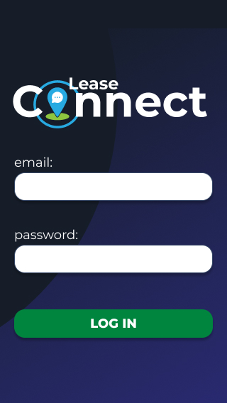
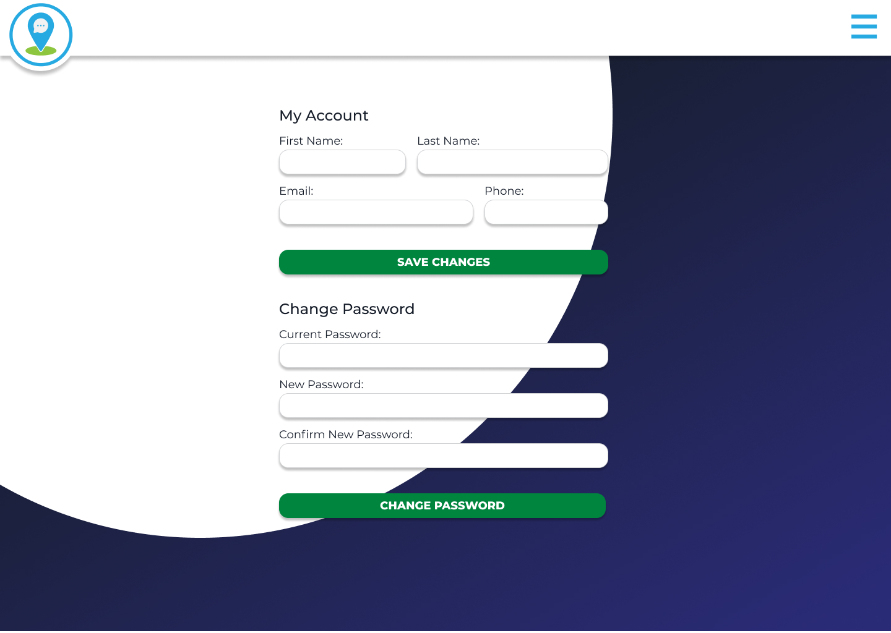

# T3A2 Full Stack App - Lease Connect
Coder Academy CA0121 Final project\
Collaborators: Gemma Elsom, Rafael Mello, Sara Fishburn

**Trello Board:** https://trello.com/b/yLfsMnFc \
**Backend Repo:** https://github.com/SaraFishburn/lease_connect_api \
**Frontend Repo:** https://github.com/SaraFishburn/lease_connect \
**Dataflow Diagram:** https://lucid.app/lucidchart/c748d4d5-41ff-4216-b178-49f2531033b7/view \
**High Fidelity Mockups:** https://www.figma.com/file/ttALn7SBGP3oeHEqA70VoG/Lease-Connect?node-id=0%3A1

 

## Lease Connect - Description

 

### Purpose

  One of the most common causes of frustration for tenants and property managers is the lack of or difficulty in contact. Missing calls and emails without replies can make people frustrated. And this is not very good for the business.
  A property manager should be reachable to their tenants without endless emails. 

  Managers or their teams can provide the best solution to the issue during business hours. With property management software the communication can go smoothly and without inconvenience at any time.

  Also property managers have a very busy life. At the office, on the road or visiting properties, they are always on the go. Having a mobile version all in one management application can help them to do the work wherever they are.
  
  
  The purpose of Lease Connect is to relieve some of these frustrations by providing a streamlined property management communication system.

 

### Functionality / features

  There are three main features of Lease Connect.

  - Maintenance Request \
    If a tenant has a maintenance issue, they may take a photo of the issue and complete a form within Lease Connect that may then be sent to the real estate for the maintenance to be organized.

    - Status Flags \
    Property managers will have the ability to set flags on these requests with pending and done to notify the tenant as to the status of the processing of the request.

  - Documentation \
    On a 'documentation' page, tenants have the ability to view all their documents pertaining to their rental (lease, entry condition report, etc) in one place. Buttons for each document will be present which when selected will direct the tenant to an image of the document in question.

    Property managers will have the ability to upload documents to a household for viewing by the tenants.

  - Calendar \
    The landing page for the tenant will be their calendar page. This page features a calendar on which events entered by the property manager pertaining to the house are marked. These events may include the expiration of the lease, maintenance entry notices, and inspection dates.

    Property managers will have the ability to add these events. In addition, property managers will have their own calendar containing all the events related to their 'pinned' properties.
  
  In addition to these main features are a number of general and additional features.

  - Creating an account \
    The general public will not have the ability to register an account and therefore accounts must be created by admin and property managers.

    Property managers and admins will have the authority to create tenant and property manager accounts.

  - Login \
    For users to access the application, they must first login with their email and password.

  - Editing Account \
    All users will have the ability to change their contact details and password once logged in.

 

### Target audience
  The target audience for Lease Connect from a client perspective is real estate agencies located in metropolitan areas in Australia. Mainly concentrated in the rentals department of those businesses. Companies that appreciate tech solutions and see the digital transformation as a great opportunity to create a more efficient and cohesive service to their tenants.

  The other audience this application is purposed for is the tenants of these businesses that appreciate a technology based solution to the communication issues that arise when renting a property managed by a real estate.

 

### Tech Stack

 

#### Front End
- React: React will be used to develop the front-end of the application. It is a Javascript library that is used to build interactive user interfaces. 

- Axios: It is a library which is used to make requests to an API, return data from the API, and then do things with that data in our React application. We are using AXIOS for all the API requests.

- Iconify: Iconify is a modern open source SVG alternative to glyph fonts. We are using Iconify for all the icons in the application.

- NodeSass: Sass is a CSS pre-processor. Sass files are executed on the server and sends CSS to the browser. We are using SCSS for styling.  

- DotENV: Allow to load environment variables dynamically for our React application. We are using to store passwords, urls and other sensitive information in our version control system.

- DayJS: Day.js is a JavaScript date library for parsing, validating, manipulating, and formatting dates. We are using day JS to manage date data (events).  

- SimpleReactCalendar: A simple calendar component for React based applications. We are using to create the calendar page.

- Netlify: Netlify will be used to deploy the front-end of Lease Connect. It is a serverless and cloud-based hosting platform, and is best used for front-end deployment.

- Cypress: Cypress is a front end testing tool, used to test the front-end (React) of our application. 

 

#### Back End
- Rails: Ruby on Rails will be used to build the back-end of Lease Connect. It is a server-side web application framework. 

- PostgreSQL: PostgreSQL will be the database system that will be used for Lease Connect. It is a powerful, object-relational database system that can be used to store data for both web and mobile applications.

- Bcrypt: Bcrypt is a password-hashing function. It’s a gem to create password digests with when you roll out your authentication logic. 

- Rack-Cors: CORS is an HTTP-header based security mechanism that defines who’s allowed to interact with our API. CORS is built into all modern web browsers. Basically its the gem that allows that communication between our back-end to the front-end.

- JWT: JSON Web Token (JWT) is an open standard that defines a compact and self-contained way for securely transmitting information between parties as a JSON object. In our application the JWT is generated if login is successful, allowing the user to have access to the app.  

- Heroku: Heroku will be used to deploy the back-end of Lease Connect. Heroku is a serverless and cloud-based hosting platform, and offers scalability and security to developers.

- Rails Test: Automated testing using the Rails build in testing system.   

 

#### External API
- Cloudinary: Cloudinary will be used to store all media that can be uploaded onto the application. Cloudinary offers a cloud-based solution to handling images and videos at any scale. 

 

## Dataflow Diagram

The following diagram outlines the flow and storage of data throughout the application. All data flow begins with the action of an external entity which in this case is a user of the application. The user action triggers a process on the front end that in turn activates a process on the backend server via a request to the backend API. The server then queries or stores data in the database and sends a response back to the frontend where appropriate.

 

Dataflow Diagram

 

## Application Architecture Diagram

The Architecture Diagram for the Lease Connect Application has been split into two sections, Client and Server. There is a key in the top left of the page that shows the meaning of different colours used throughout the diagram.

All Client side architecture is in Green, and has been wrapped in a container to show that Netlify will be the deployment platform for the front-end. React will be used to build the front-end of the application.

Heroku is the deployment platform that will be used for the back-end of the application, and the server and database are included in this. In Yellow are the API's that are used in the application, JSON and Cloudinary. The two types of Client to Server requests that will be made are JSON and HTTP.

 

Application Architecture Diagram

 

## User Stories
### MVP

  #### General Features
  - As a user I want an option for me to update my contact details so that my property manager can always contact me.

  - As an admin, I can create a household account with temporary login details so that I have control over who has an account.

  - As an admin, I can create a property manager account with temporary details so that I can control who has access to household details.

  - As an admin, I have the ability to delete household and property manager accounts so that I have control of who can access household details.

  - As a user, I want to be able to log in, so that I can access my account.

  #### Maintenance Request
  - As a property manager, I want to see which tenant made the maintenance request, so I can know who made the request and where I should send my maintenance team

  - As a property manager, I want to see all the maintenance jobs requests, so I can help the tenants to get their problem fixed

  - As a tenant, I want to upload a photo of my problem, so the property manager can understand clearly what is the problem

  - As a tenant, I want to lodge a maintenance job when I have something to get fixed at the property, so I can get the problem solved

  #### Documentation
  - As a property manager, I want to be able to serve tenants with documents, so that I don't have to send them emails with pdf attachments.

  - As a user, I want to be able to see all documentation that relates to the household.

  #### Calendar

  - As a property manager, I want to be able to clearly see all commitments I have on a given day, so that I can be sure to not miss anything important.

  - As a tenant, I want to have full coverage of any important dates, visits or inspections so that I can plan my life around these appointments.

  - As a property manager, I want to have all of my tenants lease dates in my calendar so that all of the information is stored in one, easy to read place

### Non-MVP
  The following are user stories that are not integral to the main functionality of the app but that may be implemented as features in the future.

  #### Maintenance
  - As a tenant, I want to track my maintenance job application, so I can monitor my application and know what happens next

  #### Documentation
  - As a tenant, I want to sign my lease renewal using an online form, so that I don't need to print and fill a pdf document.

  - As a tenant, I want to sign my entry condition report online so that I don't have to print and fill a pdf document.

  - As a tenant, I want to review and print my previously signed documents so that I can always have a hard copy.

  - As a tenant, I want the option to save my signature for future use so that I don't have to manually sign/upload my signature for each document.

  - As a tenant, I want to receive a notification on my portal dashboard when a document has been uploaded for me to sign so that I don't forget.

  #### Calendar
  - As a property manager, I want to be able to add reminders for inspections that tenants can also see, so that everyone is aware of upcoming important dates

  - As a property manager, I want to be able to add things to my calendar that only I have visibility to, so that I can choose what information is visible by the tenants

  - As a property manager, I want to be able to block out periods of time that I am OOO and cannot assist with enquiries, so that tenants are aware of why I may not respond immediately.

 

## Wireframes

Creation Process

### 13/07/2021

#### Brainstorm Meeting 

  Research for competitors, discussed the design concept, sketched some ideas and designs and defined some key points:
  - Mobile First
  - Blocks to organise the content 
  - collapsible menu 

  Resolution: From the sketched designs create a graphic version using Balsamiq, considering all the key point. Present the wireframes mobile version on the next meeting for approval. 

### 15/07/2021

#### Meeting Suggestions

  - "Property Manager" Property Wireframe: Add the "delete" icon to the maintenance jobs so the property managers can delete past jobs if necessary. Add the "documents" section with all previously uploaded documents related to that property. Add the "delete" icon to the documents so the property can delete a certain document.

  - "Property Manager" Create Account Wireframe: Change the naming "household" to "tenant". Add "checkbox" to the property section.

  - "Tenant" Maintenance Wireframe: Move the "new request" section to the top of the page.

  - "Admin" Home Wireframe: Change the naming "household" to "tenant". Put the "house" section before the "tenants" section.

  - Final decision: All suggestions have been implemented and final mobile wireframes uploaded

### 16/07/2021

#### Meeting Suggestions

  - "Off-canvas" menu should be a dropdown menu for Ipad and Desktop version.

  - Final decision: All suggestions have been implemented and final Ipad and Desktop wireframes uploaded

Low Fidelity Wireframes

  

  
General Components Wireframes

  Login

  The login page is the same for all users. It features a simple login screen that asks for the users email address and password. There is no option to "Register" for an account, as accounts can only be created by admin or a property manager.

  

  Menu

  All three versions of the application, mobile, tablet and desktop, include a hamburger menu that is located in the top right corner of the page. For admin and property managers the menu will display three options, "My Account", "Create Account", and "Calendar". For users with the role of tenant, the menu will display, "My Account", "Maintenance", and "Documents".

  
  

    
  

  
Property Manager Wireframes

  Home

  The property manager home page displays a list of all the houses managed by the company with the houses specifically managed by the current property manager pinned to the top. By displaying all houses, it is easy to help a colleague manage a house of theirs or cover for them when they are away. Each house record has a picture, title, address, and tenant list.

  

  Property

  This is the summary page a property manager is redirected to when they select a house on their home page. It displays a brief description of the house selected and the tenants residing there, any maintenance jobs, documents, and a button to upload new documents.

  

  Calendar

  The property manager calendar displays a calendar that is marked with any upcoming events such as inspections or days where maintenance jobs are being attended to for properties the property manager has pinned in their home page. There is a full month display of the calendar, and then upcoming events are displayed clearly with details such as event description and time.

  

  My Account

  This page allows property managers to update their account details. They can edit their first name, last name, email address, and change their password. As admin will set a generic password when the account is created, this page will need to be used to change the password to a more secure one once the property manager has been given the account details.

  

  Create Account

  This page allows property managers to create a new account for a tenant. In order to create the account, the property manager needs to provide the tenants first and last name, phone number, email address and a temporary password.

  
  

  

  
Tenant Wireframes

  Home

  The tenant home page displays a calendar that is marked with any upcoming events such as inspections or days where maintenance jobs are being attended to. There is a full month display of the calendar, and then upcoming events are displayed clearly with details such as event description and time.

  

  Maintenance

  On this page, tenants can see all previous maintenance requests that they've made. On each request there is a button that shows if the request is pending, unread, or done. They will also have the option here to create a new maintenance request.

  

  Request Maintenance

  On this page, tenants can submit a request to have maintenance done on the house. They will need to provide a summary statement of what the issue is, a further description of what needs to be fixed, and they can upload an image of the issue. This request will then be sent through to the property manager directly.

  

  Documents

  This page allows tenants to view all documents related to them. Tenant can click in the file icon to download the document. 

  

  My Account

  This page allows tenants to update their account details. They can edit their first name, last name, email address, and change their password. As admin will set a generic password when the account is created, this page will need to be used to change the password to a more secure one once the tenant has been given the account details.

  
  

  

  
Admin Wireframes

  Home 

  The Home page for admin stores information about the property managers, houses, and tenants that are linked to the admin account. On this page, admin can delete the profile for any house, tenant or property manager.

  

  Create Account

  This is the page that admin will go to in order to create an account for either a property manager, a house or a tenant. They have three clear options to choose from, and once selected they will be directed to another page for the individual account they need to create.

  

  Create Property Manager Account

  This page allows admin to create a new account for a Property Manager. In order to create the account, admin needs to provide the property managers first and last name, phone number, email address and a temporary password.

  

  Create Tenant Account

  This page allows admin to create a new account for a Tenant. In order to create the account, admin needs to provide the tenant first and last name, phone number, email address and a temporary password. And select which property the tenant belongs to. 

  

  Create House 

  On this page, admin can create an account for the individual tenants of a household. They will need to provide the tenants first name, last name, phone number, email address, a temporary password, and select which property they live in and are associated to.

  

  My Account

  In the My Account section for admin, users can change their first name, last name, and email address as well as update their password. This page can be accessed through the "My Account" option on the menu.

  
  

High Fidelity Wireframes

  
  

  
Mobile

  
  
  
  
  
  
  
  
  
  
  
  

  

  

  
Ipad

  
  
  
  
  
  
  
  
  

  

  

  
Desktop

  
  
  
  
  
  
  
  
  

  

 

## Trello Screenshots

 

Part A

We use an Agile approach to manage our project, holding daily stand-up meetings. These brief meetings allowed us to touch base and get on the same page about how the project was going. Each day we set a sprint goal for each member of the team, with daily tasks. Those daily tasks were updated and uploaded to the Trello Board.

Part B

 

## Project Management and Task Delegation 

We continued working with the Agile Methodology to manage our project, holding in-person and virtual stand-up meetings. These meetings allowed us to touch base and get on the same page about how the project was progressing. The in-person meetings allowed the present members to work together and share any questions or problems.  

Virtual meetings (video calls) and text messaging (chat) were held in Discord. The calls were held in the morning and the chat was used as a 24/7 direct point of contact between the members.

A sprint goal was set for each member of the team with daily tasks. Those tasks when complete were informed in the discord chat and pushed to the repo. 

We tried to constantly 'push' our local code to the repo. And daily 'pull' the latest code from the repo. The main goal was to always work in a fresh and updated copy of the code. 

With Github, all the features developments were made in a dedicated branch and pushed to the repo. After a pull request, another member had to check the code and merge it to the main branch.  

Task delegations were set at the beginning of the project and adapted according to the need during the process. Given that all the members had a personal preference for front-end development, we decided to divide the work into features. Where all members should work with the back-end and front-end of the designated feature. This way, any member was not overloaded with undesirable tasks.    During the process, tasks and delegations had to be adapted to the need and in-person meetings took place for 4 days.

The task delegation was input into the Trello board adding members to the user story cards.

Discord Interaction Logs

GitHub Interaction Logs

Trello Board Interaction Logs

 

## Testing

 

### Manual Testing Logs

Manual Testing

Production Testing

 

Development Testing

 

### Automated Testing Front-End

Front-End Testing

 

### Automated Testing Back-End

Back-End Testing

